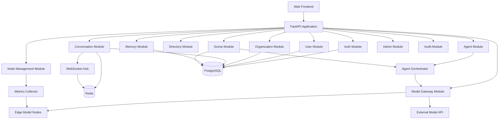

# CampusAgent：隐私优先的智能体原生校园平台
## Vibecoding 大赛完整项目计划书与开发规范

> 项目代号：CampusAgent（暂定）  
> 项目主题：教育与心理健康  
> 首发形态：Web 应用  
> 核心定位：校园通讯、组织协作、个人智能体、多智能体协商、私有化记忆与校园 AI 基础设施的一体化平台  
> 文档用途：产品统筹、团队分工、架构设计、接口约束、Claude/Coding Agent 实施依据  
> 文档状态：MVP 设计基线

---

## 0. 文档结论

CampusAgent 不是一个单一的“树洞软件”，也不是一个只服务于心理健康问答的聊天机器人。它应当被定义为：

> **一个面向高校的、隐私优先的智能体原生校园通讯与协作平台。每位学生拥有一个受权限约束的个人智能体；人与人、人与智能体、智能体与智能体可以基于校园组织和具体场景进行协作，但用户私有偏好、智能体内部协商过程和敏感记忆默认不可被其他人或普通平台管理员查看。**

平台由六个可独立演进的基础能力组成：

1. 校园身份与人员目录；
2. 学院、班级、宿舍、社团、课程等组织体系；
3. 私聊、群聊、课堂频道和场景会话；
4. 个人智能体、组织智能体和协调智能体；
5. 私有化记忆、授权、审计和数据生命周期管理；
6. 模型、边缘节点和场景插件管理。

比赛 MVP 只需证明一个核心命题：

> **当每名学生拥有一个私有智能体后，校园中的沟通、协商和组织方式可以在不暴露个人偏好的前提下变得更高效。**

首个演示场景为“宿舍聚餐去哪”。用户只向自己的个人智能体提交偏好；各个人智能体通过受控协商协议评估候选方案；系统不向群成员展示智能体辩论过程，也不长期保存原始辩论文本；群聊中只显示候选方案、聚合后的非敏感理由、投票和最终结果。

---

# 第一部分：项目背景与产品目标

## 1. 项目背景

高校校园中存在三类长期问题：

### 1.1 沟通关系碎片化

学生的校园关系分散在多个系统中：

- 教务系统保存课程和成绩；
- 微信、QQ 承担班级和社团沟通；
- 雨课堂等工具承担课堂互动；
- 心理健康平台承担测评和预约；
- 辅导员通过表格、群消息和人工访谈管理学生。

这些系统之间缺少统一的身份、组织、关系和上下文，学生需要重复注册、重复建群、重复填写资料，校方也无法形成一致的数字校园协作能力。

### 1.2 学生不愿直接表达真实想法

许多学生愿意在匿名树洞中表达，却不愿在现实群聊中说明：

- 自己不愿参加某项活动；
- 预算有限；
- 饮食禁忌；
- 对宿舍安排不满意；
- 对课程讨论没有信心；
- 正处于压力或低落状态。

直接公开表达可能造成尴尬、标签化和人际压力。因此，平台不能简单要求学生“说出来”，而应提供一种更安全的代理表达方式。

### 1.3 传统校园平台缺乏个体化协作能力

传统系统以“账号、表单、通知”为中心，而不是以“人、关系、智能体、上下文”为中心。它能完成管理，却很难：

- 理解每个学生的长期偏好；
- 代表学生参与低风险协商；
- 在不同校园场景中复用个人上下文；
- 让学生控制哪些信息可以被使用；
- 在保护隐私的前提下改善集体决策。

CampusAgent 试图建立一套新的校园数字底座。

---

## 2. 产品愿景

### 2.1 长期愿景

每名学生入学时获得一个初始化的个人智能体。随着学生主动使用和授权，该智能体逐步形成：

- 稳定的表达风格；
- 可解释的偏好模型；
- 经过用户确认的长期记忆；
- 对校园关系和组织的理解；
- 可控的代理权限；
- 在不同场景中的协作能力。

它不是复制学生人格，也不是替代学生本人，而是一个：

> **由学生拥有、由学生授权、可随时检查和撤销能力的校园数字代理。**

### 2.2 中期目标

将平台发展为可扩展的校园智能体底座，支持：

- 校园通讯录和组织管理；
- 私聊、群聊和课程频道；
- 宿舍、社团和班级活动协商；
- 课堂讨论和课程助理；
- 学习小组匹配；
- 新生适应与校园服务；
- 自愿开启的情绪记录和心理支持；
- 校方边缘模型和计算节点管理。

### 2.3 比赛目标

比赛阶段不追求“取代全部校园系统”，而是完成一个可展示、可运行、架构合理的 MVP：

- 注册学生并创建个人智能体；
- 建立组织、宿舍和群聊；
- 用户向个人智能体私下提交聚餐偏好；
- 多个智能体完成不可见的协商；
- 群聊只显示候选方案和最终结果；
- 管理后台展示模型与边缘节点；
- 记忆中心展示用户对个人数据的控制权。

---

## 3. 一句话定位与核心价值

### 3.1 一句话定位

> **CampusAgent 是一个面向高校的隐私优先型 AI 通讯与协作平台，让每位学生拥有可控的个人智能体，并通过校园组织、群聊和场景插件完成可信的多智能体协作。**

### 3.2 核心价值

对学生：

- 不必公开全部真实偏好，也能参与集体决策；
- 可以检查、修改和删除智能体记忆；
- 可以决定智能体在哪些场景中代表自己；
- 可以更自然地进入班级、宿舍、社团和课程空间。

对教师和组织者：

- 自动建立课程或组织沟通空间；
- 更容易收集意见、协调冲突和生成方案；
- 不需要直接读取个体敏感信息。

对校方：

- 形成统一的人员、组织、通讯和智能体底座；
- 可接入本地边缘节点和私有模型；
- 为未来校园应用提供标准接口；
- 在不进行隐蔽监控的前提下提供自愿式心理支持入口。

---

# 第二部分：范围、边界与产品原则

## 4. MVP 范围

### 4.1 必须完成

1. 用户注册、登录和个人资料；
2. 注册时自动创建个人智能体；
3. 学院、班级、宿舍、社团等组织的增删查改；
4. 组织成员加入、退出、邀请和角色管理；
5. 校园人员与组织搜索；
6. 私聊、普通群聊和组织群聊；
7. WebSocket 实时消息；
8. 个人智能体基础配置；
9. 私有偏好录入和记忆中心；
10. 场景中心；
11. “宿舍聚餐去哪”完整场景；
12. 模型管理、节点管理和资源监控页面；
13. 权限、授权和审计基础能力。

### 4.2 可展示但不完整实现

- 课堂讨论；
- 社团活动策划；
- 学习小组匹配；
- 新生校园助手；
- 情绪记录与校园心理资源导航。

这些场景可以展示卡片和设计说明，但比赛 MVP 中只要求聚餐场景真正可执行。

### 4.3 明确不做

比赛阶段不实现：

- 完整教务、成绩和选课系统；
- 自动心理诊断；
- 对全部聊天内容进行情绪监控；
- 未经学生同意的风险画像；
- 无限轮自由辩论；
- 复杂联邦学习或安全多方计算；
- 微服务集群；
- 原生移动端；
- 完整商业化多租户；
- 让智能体直接代替学生进行高风险决策。

---

## 5. 核心产品原则

### 5.1 隐私优先

任何涉及个人偏好、敏感记忆和心理状态的功能，都必须遵守：

- 默认私有；
- 最小采集；
- 最小暴露；
- 明确授权；
- 可撤销；
- 可删除；
- 可审计；
- 有保存期限；
- 不展示内部推理过程。

### 5.2 用户拥有智能体

个人智能体从属用户，而不是从属学校或平台管理员。

校方可以：

- 提供模型和基础设施；
- 管理组织和账号；
- 查看系统级运行指标；
- 查看经过脱敏的统计信息。

校方默认不能：

- 读取用户私有记忆；
- 读取用户提交给智能体的原始偏好；
- 查看智能体协商全过程；
- 查看模型隐藏推理；
- 将心理数据用于评奖、纪律或教学评价。

### 5.3 模块化单体优先

MVP 使用模块化单体，不使用微服务。每个模块必须：

- 有独立目录；
- 有自己的数据访问层；
- 通过公开服务接口调用；
- 不直接访问其他模块的内部表；
- 通过领域事件解耦非同步行为；
- 可在未来拆分为独立服务。

### 5.4 场景插件化

聚餐、课堂、社团等应用都通过 `Scene` 接口接入。新增场景不应修改：

- 用户模块；
- 组织模块；
- 聊天核心；
- 智能体核心；
- 记忆核心。

场景只能调用这些模块公开的接口。

### 5.5 高风险行为必须人工确认

智能体可以提出建议、表达偏好和参与低风险协商，但以下行为必须由用户确认：

- 最终报名；
- 最终支付；
- 最终选课；
- 对外发送敏感信息；
- 联系心理咨询人员；
- 向第三方共享个人数据；
- 代表用户作出不可逆承诺。

---

# 第三部分：用户角色与权限模型

## 6. 用户角色

系统支持以下基础角色：

| 角色 | 说明 | 主要权限 |
|---|---|---|
| Student | 学生 | 使用通讯、智能体、场景和个人记忆 |
| Teacher | 教师 | 创建课程组织、发布讨论、管理课程成员 |
| Counselor | 辅导员/心理支持人员 | 管理被授权的支持场景，不可读取默认私有数据 |
| OrganizationAdmin | 组织管理员 | 管理班级、社团、宿舍等指定组织 |
| SchoolAdmin | 校方管理员 | 管理学校组织、账号、模型和节点 |
| SystemAdmin | 系统管理员 | 系统配置、运维和安全审计 |

### 6.1 角色与组织角色分离

全局角色与组织内角色必须分开：

```text
GlobalRole:
- STUDENT
- TEACHER
- SCHOOL_ADMIN
- SYSTEM_ADMIN

OrganizationRole:
- OWNER
- ADMIN
- MEMBER
- GUEST
```

一个学生可以是全局 `STUDENT`，同时是某社团的 `OWNER`、某课程的 `MEMBER`。

---

## 7. 智能体代理权限

每个个人智能体具有可配置的代理等级：

| 等级 | 名称 | 能力 |
|---|---|---|
| L0 | 只读辅助 | 只能在私聊中回答用户 |
| L1 | 建议 | 可根据记忆给用户建议 |
| L2 | 受限代言 | 可在指定场景中提交结构化偏好或评分 |
| L3 | 受限决策 | 可在明确规则下自动投票 |
| L4 | 受限执行 | 可执行报名等操作，MVP 不开放 |

MVP 默认：

```text
default_autonomy_level = L1
meal_scene_max_level = L2
```

用户必须按场景单独授权 L2，不能一次授权后永久适用于所有场景。

---

# 第四部分：隐私优先的智能体协商机制

## 8. 关键设计结论

“宿舍聚餐去哪”不能实现为公开群聊中的智能体自由辩论。

正确模式是：

> **私有偏好输入 + 最小化约束抽取 + 不可见协商 + 聚合输出 + 人工确认。**

用户只能看到：

- 谁已经提交偏好；
- 候选方案；
- 每个方案的总体匹配程度；
- 非敏感的聚合理由；
- 是否存在硬约束冲突；
- 投票和最终结果。

用户不能看到：

- 其他人的原始偏好；
- 其他智能体的完整提示词；
- 智能体逐轮辩论文本；
- 单个用户的敏感理由；
- 模型隐藏推理；
- 由偏好推断出的心理或经济标签。

---

## 9. 隐私协商协议

### 9.1 阶段一：用户私有输入

每个用户在自己的私有界面中填写：

```json
{
  "budget": {
    "max": 100,
    "visibility": "agent_only"
  },
  "cuisine_preferences": ["日料", "粤菜"],
  "dietary_restrictions": ["不吃香菜"],
  "distance_limit_km": 3,
  "available_time": ["18:30-21:00"],
  "free_text": "希望安静一点，不想排队太久"
}
```

所有字段默认 `agent_only`，不会直接写入群聊。

### 9.2 阶段二：个人智能体生成偏好胶囊

个人智能体将原始输入转换为标准化的 `Preference Capsule`。

```json
{
  "scene_type": "meal_planning",
  "hard_constraints": [
    {
      "type": "budget_max",
      "value": 100
    },
    {
      "type": "exclude_ingredient",
      "value": "香菜"
    }
  ],
  "soft_preferences": [
    {
      "type": "cuisine",
      "value": "日料",
      "weight": 0.8
    },
    {
      "type": "environment",
      "value": "quiet",
      "weight": 0.6
    }
  ],
  "availability": {
    "start": "18:30",
    "end": "21:00"
  },
  "disclosure_policy": {
    "allow_raw_preference": false,
    "allow_constraint_category": true,
    "allow_aggregated_reason": true
  }
}
```

注意：

- 原始自由文本只留在个人私有域；
- 协调智能体不读取原始自由文本；
- 协调层只接收经过规则过滤的结构化胶囊；
- 胶囊中的约束也不直接展示给其他成员；
- 可进一步将预算等信息转为区间或布尔约束。

### 9.3 阶段三：候选方案生成

候选方案可以来自：

- 内置演示餐厅数据；
- 地图或餐厅 API；
- 群主手动添加；
- 协调智能体根据公开条件生成。

MVP 建议使用内置餐厅数据，避免外部 API 不稳定。

### 9.4 阶段四：私有评分

协调服务将候选方案发送给各个人智能体。每个智能体返回：

```json
{
  "candidate_id": "restaurant_001",
  "hard_constraint_passed": true,
  "utility_score": 0.82,
  "objection_level": "none",
  "reason_code": ["BUDGET_OK", "CUISINE_MATCH"],
  "public_summary_allowed": true
}
```

不允许返回：

- “用户因为经济困难只能接受 80 元以下”；
- “用户最近焦虑所以想去安静环境”；
- 用户的原始自由文本；
- 暴露身份的敏感理由。

### 9.5 阶段五：聚合

协调智能体只聚合：

- 硬约束是否通过；
- 总体效用；
- 反对级别；
- 非敏感理由码；
- 参与率。

建议聚合公式：

```text
candidate_score =
    hard_constraint_gate
    × (
        0.60 × mean_utility
        + 0.20 × fairness_score
        + 0.10 × distance_score
        + 0.10 × budget_score
      )
```

其中：

```text
hard_constraint_gate = 0
if any critical hard constraint fails

hard_constraint_gate = 1
otherwise
```

`fairness_score` 用于避免某个方案只高度满足少数人：

```text
fairness_score = 1 - standard_deviation(user_utility_scores)
```

### 9.6 阶段六：输出

群聊仅显示：

```json
{
  "title": "聚餐候选方案",
  "candidates": [
    {
      "name": "云吞面馆",
      "match_score": 92,
      "aggregate_reasons": [
        "满足全部成员的硬性限制",
        "整体预算匹配度较高",
        "距离大多数成员较近"
      ]
    }
  ],
  "privacy_notice": "个人偏好和智能体协商过程未公开。"
}
```

### 9.7 阶段七：销毁临时数据

场景结束后：

- 删除原始临时偏好，除非用户主动选择保存；
- 删除智能体协商文本；
- 删除模型中间响应；
- 保留必要的结构化审计元数据；
- 最终结果可写入场景历史；
- 是否将“用户喜欢某餐厅”写入长期记忆，必须再次征得用户同意。

---

## 10. 不保存模型思维链

系统必须明确区分：

- 对用户可见的简短解释；
- 对系统可审计的结构化结果；
- 模型内部推理过程。

开发约束：

1. 不要求模型输出详细思维链；
2. 不在数据库保存模型长推理文本；
3. 日志中不记录完整 Prompt 和敏感上下文；
4. 只保存：
   - 调用 ID；
   - 模型名；
   - Token 数；
   - 延迟；
   - 状态码；
   - 结构化输出哈希；
   - 脱敏错误信息；
5. 调试环境如需记录输入，必须使用模拟数据且明确开启调试开关；
6. 生产配置中 `LOG_PROMPT_CONTENT=false`。

---

# 第五部分：总体系统架构

## 11. 架构风格

MVP 采用：

> **前后端分离 + 模块化单体后端 + 插件化场景 + 统一模型网关 + PostgreSQL 主存储 + Redis 实时与缓存。**

推荐技术栈：

```text
Frontend:
- Next.js
- TypeScript
- Tailwind CSS
- shadcn/ui
- Zustand
- WebSocket Client

Backend:
- FastAPI
- Pydantic
- SQLAlchemy
- Alembic
- WebSocket
- BackgroundTasks / Celery（按复杂度选择）

Data:
- PostgreSQL
- pgvector
- Redis
- MinIO（可选）

AI Infrastructure:
- OpenAI-compatible Model Gateway
- vLLM / Ollama / 实验室模型节点
- 自定义 Agent Orchestrator

Monitoring:
- Prometheus
- Grafana
- NVIDIA DCGM Exporter
```

---

## 12. 逻辑架构



---

## 13. 部署架构

比赛环境建议使用 Docker Compose：

```text
docker-compose.yml
├── frontend
├── backend
├── postgres
├── redis
├── minio（可选）
├── mock-model-server
└── prometheus（可选）
```

演示时必须支持：

```bash
docker compose up -d
```

启动后自动完成：

- 数据库迁移；
- 演示数据初始化；
- 管理员账号初始化；
- 模拟模型节点注册；
- 演示宿舍和四名学生初始化；
- 内置餐厅数据加载。

---

# 第六部分：模块划分与团队并行开发

## 14. 模块总览

后端必须按以下模块拆分：

```text
backend/app/modules/
├── auth/
├── users/
├── organizations/
├── directory/
├── conversations/
├── agents/
├── memories/
├── scenes/
├── model_gateway/
├── nodes/
├── notifications/
├── audit/
├── admin/
└── wellbeing/
```

每个模块必须包含：

```text
module_name/
├── api.py
├── schemas.py
├── models.py
├── repository.py
├── service.py
├── permissions.py
├── events.py
├── exceptions.py
└── tests/
```

模块之间禁止直接导入对方的 ORM Model。允许依赖：

- 对方公开的 `service interface`；
- 对方公开的 `schemas`；
- 领域事件；
- 公共基础设施模块。

---

## 15. 模块依赖规则

### 15.1 允许依赖方向

```text
API Layer
    ↓
Application Service
    ↓
Domain Logic
    ↓
Repository Interface
    ↓
Infrastructure
```

### 15.2 禁止事项

禁止：

- 在路由函数中直接写 SQL；
- 在前端直接访问数据库；
- 一个模块直接修改另一个模块的表；
- 场景插件直接调用 ORM Session 查询用户私有数据；
- 智能体模块绕过记忆模块读取记忆；
- 管理后台绕过权限模块读取敏感数据；
- 业务代码直接依赖具体模型厂商 SDK；
- 将所有逻辑堆在一个 `main.py` 或 `utils.py` 中。

---

## 16. 推荐团队分工

### A 组：前端框架与设计系统

负责：

- 登录注册；
- 主框架；
- 导航；
- 消息界面；
- 联系人界面；
- 场景中心；
- 记忆中心；
- 管理后台页面。

依赖接口：

- OpenAPI 文档；
- WebSocket 事件协议；
- Mock API。

### B 组：身份、用户与组织

负责：

- Auth；
- User；
- Organization；
- Membership；
- Directory；
- RBAC。

### C 组：聊天与实时通信

负责：

- Conversation；
- Participant；
- Message；
- WebSocket；
- 群聊创建；
- 系统消息；
- 场景卡片消息。

### D 组：智能体、记忆与隐私

负责：

- Personal Agent；
- Agent Permission；
- Memory；
- Consent；
- Preference Capsule；
- 隐私过滤；
- Agent Run 审计。

### E 组：场景与多智能体协商

负责：

- Scene Registry；
- Scene Instance；
- Meal Planning Plugin；
- Candidate Scoring；
- Aggregation；
- Result Card；
- Scene Lifecycle。

### F 组：模型和边缘节点

负责：

- Model Gateway；
- Model Registry；
- Edge Node；
- Deployment；
- Routing；
- Health Check；
- Metrics。

各组通过接口契约和 Mock 数据并行开发，不得等待其他组完成后才开始。

---

# 第七部分：核心数据模型

## 17. 用户与组织

### 17.1 User

```sql
users
- id UUID PK
- email VARCHAR UNIQUE
- phone VARCHAR NULL
- password_hash VARCHAR
- display_name VARCHAR
- avatar_url VARCHAR NULL
- global_role VARCHAR
- status VARCHAR
- created_at TIMESTAMP
- updated_at TIMESTAMP
```

### 17.2 StudentProfile

```sql
student_profiles
- id UUID PK
- user_id UUID UNIQUE FK
- student_no VARCHAR UNIQUE
- enrollment_year INT
- major_name VARCHAR NULL
- bio VARCHAR NULL
- profile_visibility VARCHAR
- created_at TIMESTAMP
- updated_at TIMESTAMP
```

### 17.3 Organization

统一承载学校、学院、班级、宿舍、社团、课程等对象。

```sql
organizations
- id UUID PK
- name VARCHAR
- type VARCHAR
- parent_id UUID NULL
- owner_user_id UUID NULL
- description TEXT NULL
- visibility VARCHAR
- join_policy VARCHAR
- status VARCHAR
- metadata JSONB
- created_at TIMESTAMP
- updated_at TIMESTAMP
```

### 17.4 OrganizationMembership

```sql
organization_memberships
- id UUID PK
- organization_id UUID FK
- user_id UUID FK
- role VARCHAR
- status VARCHAR
- joined_at TIMESTAMP
- UNIQUE(organization_id, user_id)
```

---

## 18. 会话与消息

### 18.1 Conversation

```sql
conversations
- id UUID PK
- type VARCHAR
- title VARCHAR NULL
- avatar_url VARCHAR NULL
- owner_user_id UUID NULL
- organization_id UUID NULL
- scene_instance_id UUID NULL
- privacy_level VARCHAR
- status VARCHAR
- created_at TIMESTAMP
- updated_at TIMESTAMP
```

### 18.2 ConversationParticipant

参与者可能是用户或智能体。

```sql
conversation_participants
- id UUID PK
- conversation_id UUID FK
- participant_type VARCHAR
- user_id UUID NULL
- agent_id UUID NULL
- role VARCHAR
- joined_at TIMESTAMP
- muted BOOLEAN
- UNIQUE(conversation_id, participant_type, user_id, agent_id)
```

### 18.3 Message

```sql
messages
- id UUID PK
- conversation_id UUID FK
- sender_type VARCHAR
- sender_user_id UUID NULL
- sender_agent_id UUID NULL
- message_type VARCHAR
- content TEXT NULL
- structured_payload JSONB NULL
- visibility VARCHAR
- reply_to_id UUID NULL
- created_at TIMESTAMP
- deleted_at TIMESTAMP NULL
```

消息类型：

```text
TEXT
IMAGE
FILE
SYSTEM
AGENT_PUBLIC
SCENE_CARD
VOTE
PROPOSAL
RESULT
PRIVACY_NOTICE
```

禁止通过普通消息保存用户私有偏好。

---

## 19. 智能体与记忆

### 19.1 Agent

```sql
agents
- id UUID PK
- owner_user_id UUID NULL
- organization_id UUID NULL
- name VARCHAR
- type VARCHAR
- avatar_url VARCHAR NULL
- autonomy_level VARCHAR
- model_profile_id UUID
- status VARCHAR
- public_persona JSONB
- private_config_encrypted BYTEA NULL
- created_at TIMESTAMP
- updated_at TIMESTAMP
```

Agent 类型：

```text
PERSONAL
ORGANIZATION
COURSE
FACILITATOR
WELLBEING_SUPPORT
SYSTEM
```

### 19.2 MemoryItem

```sql
memory_items
- id UUID PK
- owner_user_id UUID FK
- agent_id UUID FK
- category VARCHAR
- content_encrypted BYTEA
- content_embedding VECTOR NULL
- sensitivity_level VARCHAR
- visibility VARCHAR
- source VARCHAR
- confidence FLOAT
- expires_at TIMESTAMP NULL
- created_at TIMESTAMP
- updated_at TIMESTAMP
- deleted_at TIMESTAMP NULL
```

### 19.3 ConsentRecord

```sql
consent_records
- id UUID PK
- user_id UUID FK
- resource_type VARCHAR
- resource_id UUID NULL
- purpose VARCHAR
- scope JSONB
- granted BOOLEAN
- expires_at TIMESTAMP NULL
- created_at TIMESTAMP
- revoked_at TIMESTAMP NULL
```

### 19.4 AgentRun

```sql
agent_runs
- id UUID PK
- agent_id UUID FK
- scene_instance_id UUID NULL
- purpose VARCHAR
- model_name VARCHAR
- input_hash VARCHAR
- output_hash VARCHAR
- latency_ms INT
- prompt_tokens INT
- completion_tokens INT
- status VARCHAR
- error_code VARCHAR NULL
- created_at TIMESTAMP
```

不得保存原始敏感输入和完整思维链。

---

## 20. 场景模型

### 20.1 SceneDefinition

```sql
scene_definitions
- id UUID PK
- scene_key VARCHAR UNIQUE
- name VARCHAR
- version VARCHAR
- description TEXT
- input_schema JSONB
- output_schema JSONB
- required_permissions JSONB
- data_retention_policy JSONB
- enabled BOOLEAN
- created_at TIMESTAMP
```

### 20.2 SceneInstance

```sql
scene_instances
- id UUID PK
- scene_definition_id UUID FK
- conversation_id UUID NULL
- creator_user_id UUID FK
- status VARCHAR
- current_stage VARCHAR
- public_context JSONB
- expires_at TIMESTAMP NULL
- created_at TIMESTAMP
- updated_at TIMESTAMP
```

### 20.3 SceneParticipant

```sql
scene_participants
- id UUID PK
- scene_instance_id UUID FK
- user_id UUID FK
- agent_id UUID FK
- consent_record_id UUID FK
- submission_status VARCHAR
- created_at TIMESTAMP
```

### 20.4 PrivateSceneSubmission

必须与普通消息隔离。

```sql
private_scene_submissions
- id UUID PK
- scene_instance_id UUID FK
- participant_id UUID FK
- encrypted_payload BYTEA
- capsule_payload JSONB NULL
- expires_at TIMESTAMP
- created_at TIMESTAMP
- deleted_at TIMESTAMP NULL
```

`encrypted_payload` 保存临时原始偏好；`capsule_payload` 只保存最小化结构化约束。场景结束后按策略删除。

### 20.5 SceneCandidate

```sql
scene_candidates
- id UUID PK
- scene_instance_id UUID FK
- title VARCHAR
- description TEXT
- public_attributes JSONB
- created_at TIMESTAMP
```

### 20.6 PrivateCandidateEvaluation

```sql
private_candidate_evaluations
- id UUID PK
- scene_instance_id UUID FK
- candidate_id UUID FK
- participant_id UUID FK
- hard_constraint_passed BOOLEAN
- utility_score FLOAT
- objection_level VARCHAR
- reason_codes JSONB
- created_at TIMESTAMP
- expires_at TIMESTAMP
```

### 20.7 SceneResult

```sql
scene_results
- id UUID PK
- scene_instance_id UUID UNIQUE FK
- selected_candidate_id UUID NULL
- ranked_candidates JSONB
- aggregate_summary JSONB
- result_status VARCHAR
- confirmed_by_user_id UUID NULL
- created_at TIMESTAMP
```

---

## 21. 模型与节点

### 21.1 ModelProfile

```sql
model_profiles
- id UUID PK
- logical_name VARCHAR UNIQUE
- provider_type VARCHAR
- capability VARCHAR
- default_parameters JSONB
- privacy_level VARCHAR
- enabled BOOLEAN
```

### 21.2 EdgeNode

```sql
edge_nodes
- id UUID PK
- name VARCHAR
- endpoint VARCHAR
- auth_secret_encrypted BYTEA
- status VARCHAR
- cpu_info JSONB
- gpu_info JSONB
- memory_total_mb INT
- last_heartbeat_at TIMESTAMP
- created_at TIMESTAMP
```

### 21.3 ModelDeployment

```sql
model_deployments
- id UUID PK
- node_id UUID FK
- model_profile_id UUID FK
- actual_model_name VARCHAR
- endpoint_path VARCHAR
- max_concurrency INT
- status VARCHAR
- created_at TIMESTAMP
```

---

# 第八部分：API 设计规范

## 22. 通用约定

### 22.1 API 前缀

```text
/api/v1
```

### 22.2 响应格式

成功：

```json
{
  "success": true,
  "data": {},
  "request_id": "req_xxx"
}
```

失败：

```json
{
  "success": false,
  "error": {
    "code": "ORG_NOT_FOUND",
    "message": "组织不存在",
    "details": {}
  },
  "request_id": "req_xxx"
}
```

### 22.3 分页

```text
?page=1&page_size=20
```

响应：

```json
{
  "items": [],
  "page": 1,
  "page_size": 20,
  "total": 100
}
```

### 22.4 幂等性

创建场景、提交偏好、确认结果等接口支持：

```text
Idempotency-Key: <uuid>
```

### 22.5 鉴权

使用：

```text
Authorization: Bearer <access_token>
```

### 22.6 错误码

格式：

```text
MODULE_REASON
```

示例：

```text
AUTH_INVALID_TOKEN
USER_NOT_FOUND
ORG_PERMISSION_DENIED
CONVERSATION_NOT_MEMBER
AGENT_CONSENT_REQUIRED
SCENE_INVALID_STAGE
MEMORY_ACCESS_DENIED
MODEL_NODE_UNAVAILABLE
```

---

## 23. Auth API

```http
POST /api/v1/auth/register
POST /api/v1/auth/login
POST /api/v1/auth/refresh
POST /api/v1/auth/logout
GET  /api/v1/auth/me
```

注册请求：

```json
{
  "email": "student@example.edu",
  "password": "******",
  "display_name": "张三",
  "student_no": "20260001",
  "organization_ids": ["class_uuid", "dorm_uuid"]
}
```

注册完成后后端发布：

```text
UserRegistered
```

Agent 模块监听事件并创建个人智能体。

---

## 24. User API

```http
GET    /api/v1/users/{user_id}
PATCH  /api/v1/users/{user_id}
GET    /api/v1/users/{user_id}/organizations
GET    /api/v1/users/{user_id}/agent
DELETE /api/v1/users/me
```

用户只能修改自己的资料，管理员修改用户状态需走 Admin API。

---

## 25. Organization API

```http
POST   /api/v1/organizations
GET    /api/v1/organizations
GET    /api/v1/organizations/{org_id}
PATCH  /api/v1/organizations/{org_id}
DELETE /api/v1/organizations/{org_id}

POST   /api/v1/organizations/{org_id}/members
GET    /api/v1/organizations/{org_id}/members
PATCH  /api/v1/organizations/{org_id}/members/{user_id}
DELETE /api/v1/organizations/{org_id}/members/{user_id}

POST   /api/v1/organizations/{org_id}/join
POST   /api/v1/organizations/{org_id}/leave
POST   /api/v1/organizations/{org_id}/create-default-conversation
```

组织删除采用软删除或归档，不物理删除历史消息。

---

## 26. Directory API

```http
GET /api/v1/directory/search?q=张三&type=user
GET /api/v1/directory/search?q=人工智能&type=organization
GET /api/v1/directory/tree
GET /api/v1/directory/recommended
```

搜索结果只返回用户允许公开的字段。

---

## 27. Conversation API

```http
POST   /api/v1/conversations
GET    /api/v1/conversations
GET    /api/v1/conversations/{conversation_id}
PATCH  /api/v1/conversations/{conversation_id}

POST   /api/v1/conversations/{conversation_id}/participants
DELETE /api/v1/conversations/{conversation_id}/participants/{participant_id}

GET    /api/v1/conversations/{conversation_id}/messages
POST   /api/v1/conversations/{conversation_id}/messages
DELETE /api/v1/messages/{message_id}
```

创建群聊：

```json
{
  "type": "GROUP",
  "title": "8栋302宿舍",
  "participant_user_ids": ["u1", "u2", "u3", "u4"],
  "attach_group_agent": true
}
```

消息接口不得用于提交私有偏好。私有偏好必须使用 Scene API。

---

## 28. WebSocket 协议

连接：

```text
/ws/v1?token=<access_token>
```

客户端事件：

```json
{
  "event": "conversation.subscribe",
  "data": {
    "conversation_id": "uuid"
  }
}
```

服务端事件：

```text
message.created
message.deleted
conversation.updated
participant.joined
participant.left
scene.updated
scene.result.generated
notification.created
```

示例：

```json
{
  "event": "scene.updated",
  "data": {
    "scene_instance_id": "scene_uuid",
    "stage": "WAITING_FOR_PRIVATE_INPUT",
    "submitted_count": 3,
    "total_count": 4
  }
}
```

WebSocket 不发送任何其他成员的私有偏好。

---

## 29. Agent API

```http
GET   /api/v1/agents/me
PATCH /api/v1/agents/me
POST  /api/v1/agents/me/chat
GET   /api/v1/agents/me/permissions
PATCH /api/v1/agents/me/permissions
GET   /api/v1/agents/me/runs
```

权限修改请求：

```json
{
  "scene_key": "meal_planning",
  "autonomy_level": "L2",
  "allowed_memory_categories": [
    "FOOD_PREFERENCE",
    "BUDGET_PREFERENCE"
  ],
  "expires_at": "2026-07-14T00:00:00+09:00"
}
```

---

## 30. Memory API

```http
GET    /api/v1/memories
POST   /api/v1/memories
GET    /api/v1/memories/{memory_id}
PATCH  /api/v1/memories/{memory_id}
DELETE /api/v1/memories/{memory_id}

POST   /api/v1/memories/{memory_id}/share
POST   /api/v1/memories/{memory_id}/revoke
GET    /api/v1/memories/access-log
POST   /api/v1/memories/export
```

记忆读取必须经过：

```python
memory_service.query(
    owner_user_id=current_user.id,
    purpose="meal_planning",
    allowed_categories=["FOOD_PREFERENCE"],
    consent_id=consent_id
)
```

任何模块不得直接查询 `memory_items` 表。

---

## 31. Scene API

```http
GET  /api/v1/scenes
GET  /api/v1/scenes/{scene_key}

POST /api/v1/scene-instances
GET  /api/v1/scene-instances/{instance_id}
POST /api/v1/scene-instances/{instance_id}/participants
POST /api/v1/scene-instances/{instance_id}/consent
POST /api/v1/scene-instances/{instance_id}/private-submission
POST /api/v1/scene-instances/{instance_id}/start
GET  /api/v1/scene-instances/{instance_id}/candidates
POST /api/v1/scene-instances/{instance_id}/vote
POST /api/v1/scene-instances/{instance_id}/confirm
POST /api/v1/scene-instances/{instance_id}/cancel
```

### 31.1 创建聚餐场景

```json
{
  "scene_key": "meal_planning",
  "conversation_id": "conversation_uuid",
  "participant_user_ids": ["u1", "u2", "u3", "u4"],
  "public_context": {
    "date": "2026-07-13",
    "city": "广州",
    "meeting_point": "学校南门"
  }
}
```

### 31.2 提交私有偏好

```json
{
  "preferences": {
    "budget_max": 100,
    "cuisines": ["日料", "粤菜"],
    "excluded_ingredients": ["香菜"],
    "distance_limit_km": 3,
    "notes": "希望安静一些"
  },
  "save_to_long_term_memory": false
}
```

响应不得返回原始偏好，只返回：

```json
{
  "submission_status": "ACCEPTED",
  "capsule_generated": true,
  "expires_at": "2026-07-14T00:00:00+09:00"
}
```

### 31.3 查询场景状态

```json
{
  "id": "scene_uuid",
  "status": "ACTIVE",
  "stage": "WAITING_FOR_PRIVATE_INPUT",
  "progress": {
    "submitted": 3,
    "total": 4
  },
  "privacy": {
    "debate_visible": false,
    "raw_preferences_visible": false
  }
}
```

---

## 32. Model Gateway API

上层统一调用：

```http
POST /internal/v1/model/chat
POST /internal/v1/model/embedding
GET  /internal/v1/model/health
```

请求：

```json
{
  "logical_model": "campus-reasoning-model",
  "messages": [],
  "response_schema": {},
  "privacy_context": {
    "contains_sensitive_data": true,
    "allow_external_provider": false
  },
  "timeout_ms": 30000
}
```

路由规则：

1. 敏感数据优先本地节点；
2. 外部模型仅在用户授权且配置允许时使用；
3. 模型节点不可用时可降级到规则引擎或 Mock 模型；
4. 场景插件不得直接调用 OpenAI、Anthropic 等厂商 SDK；
5. 所有调用必须经过统一模型网关。

---

## 33. Node Management API

```http
POST   /api/v1/admin/nodes
GET    /api/v1/admin/nodes
GET    /api/v1/admin/nodes/{node_id}
PATCH  /api/v1/admin/nodes/{node_id}
DELETE /api/v1/admin/nodes/{node_id}
POST   /api/v1/admin/nodes/{node_id}/health-check
GET    /api/v1/admin/nodes/{node_id}/metrics

POST   /api/v1/admin/models
GET    /api/v1/admin/models
POST   /api/v1/admin/deployments
GET    /api/v1/admin/deployments
```

---

# 第九部分：场景插件规范

## 34. Scene Plugin Interface

所有场景必须实现统一接口：

```python
from typing import Protocol

class ScenePlugin(Protocol):
    scene_key: str
    version: str

    def get_definition(self) -> dict:
        ...

    async def validate_public_context(self, context: dict) -> None:
        ...

    async def validate_private_submission(
        self,
        user_id: str,
        payload: dict
    ) -> None:
        ...

    async def build_preference_capsule(
        self,
        user_id: str,
        private_payload: dict,
        consent_scope: dict
    ) -> dict:
        ...

    async def generate_candidates(
        self,
        public_context: dict
    ) -> list[dict]:
        ...

    async def evaluate_candidate(
        self,
        agent_id: str,
        capsule: dict,
        candidate: dict
    ) -> dict:
        ...

    async def aggregate(
        self,
        candidates: list[dict],
        evaluations: list[dict]
    ) -> dict:
        ...

    async def build_public_result(
        self,
        aggregate_result: dict
    ) -> dict:
        ...

    async def cleanup_private_data(
        self,
        scene_instance_id: str
    ) -> None:
        ...
```

### 34.1 场景插件不得做的事情

- 直接查询用户记忆表；
- 直接向群聊写消息；
- 直接读取用户完整个人资料；
- 直接调用具体模型厂商；
- 持久化未声明的数据；
- 返回其他用户的偏好；
- 输出详细智能体辩论文本。

它只能通过：

```text
MemoryService
ConsentService
AgentService
ConversationService
ModelGateway
AuditService
```

完成操作。

---

## 35. 场景生命周期

统一状态机：

```text
DRAFT
  ↓
WAITING_FOR_PARTICIPANTS
  ↓
WAITING_FOR_CONSENT
  ↓
WAITING_FOR_PRIVATE_INPUT
  ↓
PROCESSING
  ↓
CANDIDATES_READY
  ↓
VOTING
  ↓
CONFIRMING
  ↓
COMPLETED
```

异常状态：

```text
CANCELLED
FAILED
EXPIRED
```

状态转换必须由 SceneService 控制，插件不能任意修改数据库状态。

---

# 第十部分：首个场景详细设计

## 36. 宿舍聚餐去哪

### 36.1 用户流程

1. 用户在宿舍群中点击“发起聚餐协商”；
2. 选择日期、时间、地点和参与成员；
3. 系统要求每位成员授权个人智能体参与本次场景；
4. 每位成员进入私有表单填写偏好；
5. 群聊只显示“3/4 人已提交”；
6. 全部提交或超时后启动协商；
7. 个人智能体私下评价候选餐厅；
8. 协调智能体进行聚合；
9. 群聊显示三个候选方案；
10. 成员投票；
11. 群主或发起人确认最终方案；
12. 系统询问每位用户是否将本次结果写入个人记忆；
13. 删除临时偏好和协商数据。

### 36.2 页面要求

私有偏好页：

- 预算上限；
- 菜系偏好；
- 饮食禁忌；
- 可接受距离；
- 时间；
- 环境偏好；
- 其他说明；
- 是否保存为长期偏好。

群聊场景卡：

- 场景标题；
- 参与人数；
- 提交进度；
- 当前阶段；
- 隐私说明；
- 取消或退出按钮。

结果卡：

- 候选方案；
- 匹配分；
- 距离；
- 预算；
- 聚合理由；
- 投票按钮；
- 最终确认按钮。

### 36.3 内置演示数据

至少准备 8 家餐厅：

```json
[
  {
    "id": "r1",
    "name": "南门粤菜馆",
    "cuisines": ["粤菜"],
    "average_price": 75,
    "distance_km": 1.2,
    "environment": ["quiet"],
    "ingredients_supported": ["no_cilantro"]
  },
  {
    "id": "r2",
    "name": "校园日料屋",
    "cuisines": ["日料"],
    "average_price": 98,
    "distance_km": 0.8,
    "environment": ["quiet"]
  }
]
```

### 36.4 演示必须证明的隐私特性

- A 用户看不到 B 的预算；
- 群主看不到其他成员的自由文本；
- 群聊中没有智能体辩论记录；
- 管理员后台没有“查看偏好”入口；
- 最终理由只说明“整体预算匹配度高”，不指出谁预算较低；
- 场景结束后私有输入可自动删除；
- 用户能在审计页看到“聚餐场景于某时读取了饮食偏好”。

---

# 第十一部分：心理健康模块边界

## 37. 产品原则

心理健康是项目背景和未来方向，但 MVP 中必须避免将其实现为隐蔽监控工具。

允许：

- 用户主动发起的倾诉；
- 情绪日记；
- 自我状态记录；
- 校园心理资源推荐；
- 咨询预约入口；
- 用户自愿授权的周期性提醒；
- 明确的危机求助指引。

禁止：

- 自动分析全部私聊和群聊；
- 给学生生成不可见的风险标签；
- 未授权地向辅导员上报；
- 使用模型进行临床诊断；
- 将心理数据用于奖惩；
- 把普通负面表达直接判定为危机。

### 37.1 数据域隔离

```text
General Campus Domain
Wellbeing Domain
```

心理相关数据使用独立表、独立权限策略和独立审计类别。普通组织管理员无法访问。

---

# 第十二部分：前端信息架构

## 38. 主导航

```text
首页
消息
联系人
组织
智能体
场景中心
记忆中心
个人设置
```

管理员附加：

```text
用户管理
组织管理
模型管理
节点管理
运行监控
安全审计
```

---

## 39. 页面清单

### 39.1 登录与注册

- 登录；
- 注册；
- 学号信息；
- 加入学院、班级和宿舍；
- 初始化个人智能体；
- 完成偏好问答。

### 39.2 首页

- 最近消息；
- 待处理邀请；
- 当前场景；
- 推荐组织；
- 智能体状态；
- 隐私提醒。

### 39.3 消息页

左栏：

- 私聊；
- 群聊；
- 课程；
- 社团；
- 场景会话。

中栏：

- 消息列表；
- 输入框；
- 场景卡；
- 投票卡。

右栏：

- 群成员；
- 群智能体；
- 共享文件；
- 当前场景；
- 群权限。

### 39.4 联系人

- 搜索用户；
- 搜索组织；
- 组织树；
- 最近联系人；
- 推荐同学；
- 发起私聊；
- 邀请加入群聊。

### 39.5 智能体中心

- 智能体头像和名称；
- 对话；
- 表达风格；
- 代理等级；
- 场景权限；
- 绑定模型；
- 最近调用；
- 数据使用说明。

### 39.6 记忆中心

- 记忆分类；
- 敏感等级；
- 来源；
- 使用记录；
- 修改；
- 删除；
- 撤销共享；
- 导出；
- 自动过期设置。

### 39.7 场景中心

卡片：

- 宿舍聚餐协商：可用；
- 社团活动策划：即将上线；
- 课程讨论：即将上线；
- 学习小组：即将上线；
- 新生助手：即将上线；
- 情绪记录：概念展示。

### 39.8 管理后台

- 用户数量；
- 组织数量；
- 活跃会话；
- 场景执行次数；
- 模型请求量；
- 节点状态；
- GPU/CPU；
- 延迟；
- 错误率；
- 不包含个人偏好和聊天明文。

---

# 第十三部分：安全与隐私工程要求

## 40. 数据分类

| 等级 | 示例 | 存储要求 |
|---|---|---|
| P0 公开 | 公开组织名称 | 普通存储 |
| P1 内部 | 班级成员关系 | 访问控制 |
| P2 私有 | 饮食偏好、预算 | 加密、授权、审计 |
| P3 高敏感 | 心理状态、咨询记录 | 独立域、强加密、最小访问 |
| P4 临时秘密 | 场景原始偏好、协商输入 | 临时存储、自动销毁 |

### 40.1 加密

- HTTPS；
- 数据库敏感字段应用层加密；
- 密钥放入环境变量或密钥管理服务；
- 密码使用强哈希；
- 节点密钥不得明文写入数据库；
- 日志脱敏；
- 导出文件设置有效期。

### 40.2 授权

所有敏感读取必须包含：

```text
who
what
purpose
scope
expiration
consent
```

### 40.3 审计

记录：

```text
actor_id
action
resource_type
resource_id
purpose
result
timestamp
request_id
```

但审计日志不得记录敏感内容本身。

### 40.4 数据保留策略

默认：

```text
Raw private scene submission: 场景结束后立即删除，最长 24 小时
Preference capsule: 场景结束后删除，最长 24 小时
Private candidate evaluation: 场景结束后删除，最长 24 小时
Final scene result: 保留
Agent run metadata: 保留 30 天
System audit metadata: 保留 90 天
Long-term memory: 用户主动确认后保留
```

### 40.5 隐私失败时的行为

若授权服务、加密服务或私有数据隔离失败：

> **拒绝执行场景，而不是降级为公开处理。**

---

# 第十四部分：开发仓库与代码规范

## 41. Monorepo 结构

```text
campus-agent/
├── apps/
│   ├── web/
│   └── api/
├── packages/
│   ├── api-client/
│   ├── shared-types/
│   ├── ui/
│   └── config/
├── infra/
│   ├── docker/
│   ├── prometheus/
│   └── scripts/
├── docs/
│   ├── architecture/
│   ├── api/
│   ├── privacy/
│   └── decisions/
├── tests/
│   ├── e2e/
│   └── fixtures/
├── docker-compose.yml
├── .env.example
├── Makefile
└── README.md
```

后端：

```text
apps/api/app/
├── main.py
├── core/
│   ├── config.py
│   ├── database.py
│   ├── security.py
│   ├── events.py
│   ├── logging.py
│   └── exceptions.py
├── modules/
└── tests/
```

---

## 42. 编码约束

### 42.1 后端

- 全部函数添加类型注解；
- Pydantic Schema 与 ORM Model 分离；
- Repository 不包含业务规则；
- Service 不返回 ORM 对象给 API；
- API 只负责参数解析、鉴权和响应；
- 所有时间使用带时区的 UTC 存储；
- 所有 ID 使用 UUID；
- 所有数据库变更通过 Alembic；
- 禁止手工修改生产数据库；
- 敏感字段不得出现在 `repr`；
- 外部调用必须设置超时、重试和熔断；
- 场景状态转换必须使用状态机；
- 关键创建接口支持幂等性。

### 42.2 前端

- TypeScript 严格模式；
- API 类型从 OpenAPI 生成；
- 页面不得自行拼接后端字段；
- 隐私提示必须在提交偏好前可见；
- 私有输入页面不能复用普通聊天输入框；
- 所有 loading、empty、error 状态完整；
- 场景状态由后端驱动；
- 不在浏览器 LocalStorage 保存敏感偏好；
- Token 优先使用 HttpOnly Cookie；
- 所有可删除操作提供确认。

### 42.3 日志

禁止：

```python
logger.info(f"user preference: {payload}")
logger.debug(f"prompt: {messages}")
```

允许：

```python
logger.info(
    "scene_submission_received",
    extra={
        "scene_instance_id": scene_id,
        "user_id_hash": hash_user_id(user_id),
        "payload_size": len(encrypted_payload)
    }
)
```

---

## 43. Git 规范

分支：

```text
main
develop
feature/<module>-<description>
fix/<module>-<description>
```

提交：

```text
feat(scene): add private meal preference submission
fix(memory): prevent unauthorized memory access
refactor(chat): extract websocket event publisher
test(agent): add consent validation cases
docs(privacy): define data retention policy
```

合并要求：

- 至少一人 Review；
- 测试通过；
- 无敏感信息；
- OpenAPI 未发生非预期破坏；
- 重要架构决策写入 ADR。

---

## 44. 环境变量

`.env.example` 至少包含：

```env
APP_ENV=development
APP_SECRET=
DATABASE_URL=
REDIS_URL=
JWT_SECRET=
FIELD_ENCRYPTION_KEY=
MODEL_GATEWAY_BASE_URL=
MODEL_GATEWAY_API_KEY=
LOG_LEVEL=INFO
LOG_PROMPT_CONTENT=false
ENABLE_EXTERNAL_MODEL=false
PRIVATE_SCENE_TTL_HOURS=24
```

不得提交真实密钥。

---

# 第十五部分：测试计划

## 45. 测试层次

### 45.1 单元测试

重点覆盖：

- 组织权限；
- 场景状态机；
- 偏好胶囊过滤；
- 候选评分；
- 聚合算法；
- 记忆访问策略；
- 数据过期；
- 模型路由。

### 45.2 集成测试

覆盖：

- 注册后自动创建智能体；
- 创建宿舍组织后建立群聊；
- 用户授权后提交偏好；
- 未授权不能读取记忆；
- 协商结束后删除临时数据；
- 模型节点不可用时正确降级；
- WebSocket 正确推送状态。

### 45.3 隐私测试

必须包含：

1. A 用户不能读取 B 的偏好；
2. 群管理员不能读取成员私有提交；
3. SchoolAdmin 不能读取 P2/P3 内容；
4. 普通聊天接口不能查询私有提交；
5. 日志中不存在原始偏好；
6. 场景结束后私有数据被删除；
7. 未授权 Agent Run 被拒绝；
8. 场景插件不能绕过 MemoryService；
9. 导出数据只包含当前用户数据；
10. 取消授权后新请求立即失效。

### 45.4 E2E 演示测试

完整流程：

```text
注册四名学生
→ 自动创建四个智能体
→ 创建宿舍
→ 创建宿舍群
→ 发起聚餐场景
→ 四人私有提交
→ 生成候选方案
→ 群聊显示结果
→ 用户投票
→ 确认结果
→ 清理临时数据
```

---

# 第十六部分：开发阶段与里程碑

## 46. 阶段 0：项目初始化

产物：

- Monorepo；
- Docker Compose；
- CI；
- 数据库；
- Redis；
- OpenAPI；
- 前后端基础页面；
- Mock Server；
- ADR 模板。

验收：

```bash
make dev
make test
make seed
```

均可运行。

---

## 47. 阶段 1：身份与组织底座

实现：

- 注册登录；
- User；
- StudentProfile；
- Organization；
- Membership；
- Directory；
- RBAC；
- 注册后创建智能体事件。

验收：

- 能创建学院、班级、宿舍、社团；
- 能加入和退出；
- 能搜索用户和组织；
- 权限测试通过。

---

## 48. 阶段 2：聊天底座

实现：

- Conversation；
- Participant；
- Message；
- WebSocket；
- 群聊；
- 组织默认群聊；
- 系统消息；
- 场景卡消息。

验收：

- 两用户可私聊；
- 四用户可实时群聊；
- 新成员加入群聊收到事件；
- 非成员不能读取消息。

---

## 49. 阶段 3：智能体与记忆

实现：

- Personal Agent；
- 初始化问答；
- Agent Chat；
- Memory CRUD；
- Consent；
- Agent Permission；
- Audit；
- Model Gateway Mock。

验收：

- 每个用户有独立智能体；
- 用户能查看和删除记忆；
- 智能体只能读取授权类别；
- 管理员看不到私有内容。

---

## 50. 阶段 4：聚餐场景

实现：

- Scene Registry；
- Scene State Machine；
- Meal Plugin；
- Private Submission；
- Preference Capsule；
- Candidate；
- Private Evaluation；
- Aggregation；
- Result Card；
- Cleanup。

验收：

- 四个智能体完成协商；
- 群聊不展示过程；
- 用户看不到他人偏好；
- 能生成三项候选方案；
- 能投票并确认；
- 临时数据按策略删除。

---

## 51. 阶段 5：模型与节点管理

实现：

- Model Registry；
- Edge Node；
- Deployment；
- Health Check；
- Metrics；
- Admin Dashboard；
- 模拟 GPU 数据。

验收：

- 可新增节点；
- 可新增逻辑模型；
- 可查看节点在线状态；
- 可查看 CPU/GPU/显存；
- 场景调用经过模型网关。

---

## 52. 阶段 6：演示与质量提升

实现：

- 演示数据；
- 页面动效；
- 错误处理；
- 隐私说明；
- 一键启动；
- E2E；
- 演示脚本；
- 备用 Mock 模型。

验收：

- 无外网也能完成核心演示；
- 模型失败可使用 Mock 结果；
- 页面无明显空白和异常；
- 5 分钟内完成完整汇报演示。

---

# 第十七部分：验收标准

## 53. 产品验收

- [ ] 新用户注册后自动获得个人智能体；
- [ ] 用户可加入学院、班级、宿舍和社团；
- [ ] 用户可搜索人员和组织；
- [ ] 用户可创建群聊；
- [ ] 智能体可作为参与者存在；
- [ ] 场景中心可创建聚餐场景；
- [ ] 用户通过私有表单提交偏好；
- [ ] 群聊不展示私有偏好；
- [ ] 群聊不展示智能体辩论过程；
- [ ] 系统返回候选方案和聚合理由；
- [ ] 用户可投票和确认；
- [ ] 用户可查看记忆和授权记录；
- [ ] 管理员可管理模型和节点。

## 54. 架构验收

- [ ] 每个模块有明确目录和公开接口；
- [ ] 场景插件不直接访问用户、记忆和聊天表；
- [ ] 上层不直接调用具体模型 SDK；
- [ ] ORM Model 不跨模块引用；
- [ ] OpenAPI 文档可生成；
- [ ] 数据库迁移可回放；
- [ ] Docker Compose 一键启动；
- [ ] E2E 测试覆盖核心流程。

## 55. 隐私验收

- [ ] 私有偏好不进入普通消息表；
- [ ] 原始偏好加密；
- [ ] 日志不记录敏感内容；
- [ ] 管理员无私有偏好读取接口；
- [ ] 辩论文本不保存；
- [ ] 场景结束后自动清理；
- [ ] 每次记忆访问有目的和授权；
- [ ] 用户可以撤销授权；
- [ ] 用户可以删除记忆；
- [ ] 心理相关能力默认关闭。

---

# 第十八部分：风险与应对

## 56. 主要风险

### 56.1 项目范围过大

应对：

- 只完整实现一个场景；
- 课堂、社团等只做接口和展示；
- 先做通讯与组织底座；
- 禁止临时增加复杂功能。

### 56.2 多智能体输出不稳定

应对：

- 使用结构化 JSON 输出；
- 使用固定状态机；
- 限制协商轮数；
- 使用候选评分而非自由辩论；
- 提供规则引擎和 Mock 结果；
- 最终决策人工确认。

### 56.3 隐私设计流于口号

应对：

- 私有数据独立表；
- 明确 TTL；
- 删除任务；
- 权限测试；
- 无管理员读取接口；
- 演示中现场证明 A 看不到 B 的偏好。

### 56.4 团队并行开发产生冲突

应对：

- 先冻结 API；
- 提供 Mock；
- 模块不得跨表；
- 使用领域事件；
- 每个组维护自己的测试；
- 重要变更必须写 ADR。

### 56.5 边缘节点不稳定

应对：

- 模型网关统一封装；
- 健康检查；
- 失败重试；
- 规则降级；
- Mock 模型；
- 演示不依赖单一真实节点。

---

# 第十九部分：Claude 开发执行约束

## 57. Claude 的工作目标

Claude 应当把本计划书视为项目的架构基线，而不是随意重构的参考。

实现顺序：

1. 初始化仓库和基础设施；
2. 建立数据库模型和迁移；
3. 实现 Auth/User/Organization；
4. 实现 Conversation/WebSocket；
5. 实现 Agent/Memory/Consent；
6. 实现 Scene Core；
7. 实现 Meal Plugin；
8. 实现 Model Gateway/Node；
9. 实现前端页面；
10. 完成测试和演示数据。

---

## 58. Claude 必须遵守的硬约束

1. 不得把全部代码写入少数文件；
2. 不得跳过模块边界；
3. 不得让场景插件直接访问其他模块数据表；
4. 不得使用普通消息接口提交私有偏好；
5. 不得在日志输出用户偏好、Prompt 或模型完整响应；
6. 不得保存模型思维链；
7. 不得为方便演示而给管理员开放私有数据；
8. 不得将密钥写死在代码中；
9. 不得省略数据库迁移；
10. 不得省略权限测试；
11. 不得把心理健康实现为自动监控；
12. 不得在未授权时调用个人记忆；
13. 不得将真实个人数据写入种子数据；
14. 不得绕过 Model Gateway；
15. 不得引入微服务、消息中间件集群等不必要复杂度。

---

## 59. Claude 每个模块的交付格式

每完成一个模块，应输出：

```text
1. 本模块目标
2. 新增文件
3. 数据模型
4. API
5. 权限规则
6. 事件
7. 测试
8. 启动与验证命令
9. 已知限制
10. 对其他模块的公开契约
```

每个 Pull Request 必须包含：

- 代码；
- 测试；
- 数据库迁移；
- OpenAPI 更新；
- README 或模块说明；
- 无敏感日志检查。

---

## 60. 建议给 Claude 的首条执行指令

```text
你正在开发 CampusAgent，一个隐私优先的智能体原生校园平台。

请严格依据 docs/CampusAgent_Project_Plan.md 开发，不要擅自扩大范围。

第一阶段只完成：
1. Monorepo 初始化；
2. Docker Compose；
3. FastAPI 基础工程；
4. Next.js 基础工程；
5. PostgreSQL、Redis；
6. Auth/User/Organization 三个后端模块骨架；
7. 模块化目录、统一错误格式、日志和配置；
8. Alembic 初始化；
9. OpenAPI；
10. 基础测试与 README。

硬约束：
- 模块化单体；
- ORM Model 不得跨模块直接引用；
- API、Service、Repository、Schema 分层；
- 敏感数据不得写日志；
- 所有配置进入环境变量；
- 不实现微服务；
- 不提前实现聚餐场景；
- 完成后给出文件树、启动命令、测试命令和未完成项。
```

---

# 第二十部分：比赛汇报脚本主线

## 61. 五段式汇报

### 第一段：问题

传统校园平台管理的是账号和流程，却很难帮助学生安全地表达真实偏好。学生不愿在群里直接说预算、禁忌和顾虑，集体协商效率低。

### 第二段：设想

每名学生入学时获得一个私有智能体。学生可以只向自己的智能体表达，智能体在用户授权范围内参与协作。

### 第三段：平台

展示：

- 校园人员；
- 学院、班级、宿舍；
- 群聊；
- 个人智能体；
- 记忆中心；
- 模型和边缘节点。

### 第四段：现场场景

四名宿舍成员讨论聚餐：

- 每人私下填写偏好；
- 群聊只能看到提交进度；
- 智能体完成不可见协商；
- 系统展示三个候选方案；
- 用户投票并确认。

重点展示：

> “系统完成了协商，但没有公开任何人的具体偏好，也没有展示智能体的辩论过程。”

### 第五段：未来

同一套底座可继续接入：

- 课堂讨论；
- 社团策划；
- 学习小组；
- 新生服务；
- 自愿式心理支持；
- 校园管理。

---

# 结语

CampusAgent 的价值不在于增加一个聊天机器人，而在于建立一种新的校园协作方式：

> **学生可以保留不愿公开的真实偏好，同时仍然参与集体决策；智能体可以代表用户协作，但平台不能借此获得对用户的无限知情权。**

因此，项目最重要的技术目标不是“让智能体说得更多”，而是：

1. 让每个用户拥有自己的智能体；
2. 让智能体在标准协议下协作；
3. 让协商结果可用；
4. 让偏好和过程保持私有；
5. 让任何新场景都能通过模块化接口接入；
6. 让用户始终拥有授权、检查、撤销和删除的权利。

该原则应当贯穿产品设计、数据模型、接口、日志、测试、演示和后续扩展。
